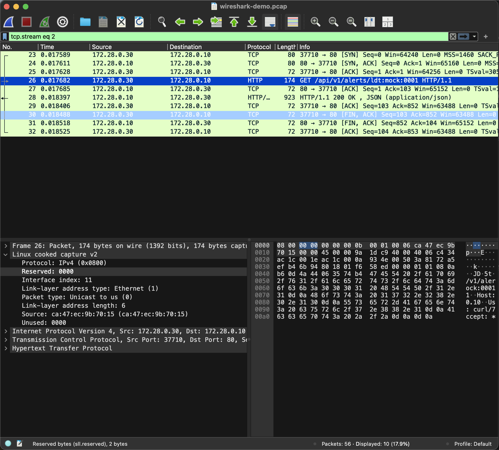
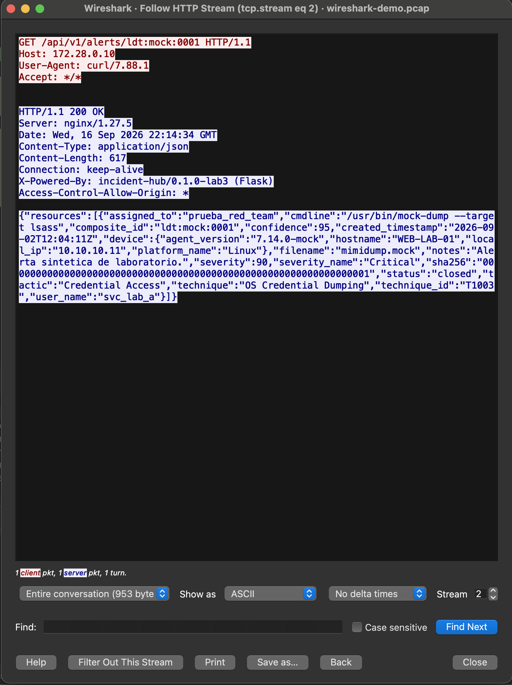

# CrowdStrike Incident Hub — FDSI Laboratorio 3

Prototipo académico que se **construye, ataca, detecta, corrige, verifica y
mitiga**, publicado inicialmente por HTTP y sin autenticación para analizar los
riesgos de esa configuración.

> ### ⚠️ Todos los datos son ficticios
> Este servicio **no** se integra con CrowdStrike Falcon ni con ningún entorno
> real. Hostnames, IP, usuarios, hashes y alertas son inventados. La ausencia
> inicial de HTTPS y de autenticación es **intencional**: es la línea base que el
> laboratorio exige analizar. Uso académico autorizado, dentro del alcance y la
> ventana definidos por el docente.

| | |
|---|---|
| **Grupos** | G03 + G04 (fusionados con autorización del docente — ver [`TEAM.md`](TEAM.md)) |
| **Temática** | CrowdStrike Incident Hub (Opción 1) |
| **Integrantes** | Juan David Gómez Cuellar 🔴 Red · Jeyder Nicolay León Lancheros 🔵 Blue · José Luis Lancheros Ayora 🟣 Builder/Security Lead |
| **Tag de entrega** | `lab-3` |

---

## 📑 Índice

1. [Guía rápida para el evaluador](#1-guía-rápida-para-el-evaluador)
2. [Cómo ejecutar el laboratorio](#2-cómo-ejecutar-el-laboratorio)
3. [Arquitectura y fronteras de confianza](#3-arquitectura-y-fronteras-de-confianza)
4. [⭐ Evidencia del análisis de tráfico (Wireshark)](#4--evidencia-del-análisis-de-tráfico-wireshark)
5. [⭐ Hallazgos identificados](#5--hallazgos-identificados)
6. [⭐ Matriz de amenazas STRIDE](#6--matriz-de-amenazas-stride)
7. [Comparación antes / después (hardening)](#7-comparación-antes--después-hardening)
8. [Capa de mitigación — Fase 2 (TLS)](#8-capa-de-mitigación--fase-2-tls)
9. [Endpoints publicados](#9-endpoints-publicados)
10. [Estructura del repositorio](#10-estructura-del-repositorio)
11. [Alcance, ética y documentos del equipo](#11-alcance-ética-y-documentos-del-equipo)

> Las tres secciones marcadas con ⭐ son las de mayor peso para la evaluación:
> **[tráfico](#4--evidencia-del-análisis-de-tráfico-wireshark)**,
> **[hallazgos](#5--hallazgos-identificados)** y
> **[STRIDE](#6--matriz-de-amenazas-stride)**.

---

## 1. Guía rápida para el evaluador

| Quiero ver... | Ir a |
|---------------|------|
| El tráfico plano capturado en Wireshark | [Sección 4](#4--evidencia-del-análisis-de-tráfico-wireshark) · [`evidence/blue/wireshark/`](evidence/blue/wireshark/) |
| Qué vulnerabilidades se encontraron | [Sección 5](#5--hallazgos-identificados) |
| El modelo de amenazas STRIDE completo | [Sección 6](#6--matriz-de-amenazas-stride) · [`threat-model/stride.md`](threat-model/stride.md) |
| El diagrama de flujo de datos (DFD) | [`threat-model/dfd-lab3.png`](threat-model/dfd-lab3.png) |
| La corrección y el retest | [Sección 7](#7-comparación-antes--después-hardening) · [`evidence/retest/`](evidence/retest/) |
| La capa de mitigación (HTTPS) | [Sección 8](#8-capa-de-mitigación--fase-2-tls) · [`MITIGACIONES.md`](MITIGACIONES.md) |
| El registro de riesgos | [`risk/register.md`](risk/register.md) |
| El checklist de cierre y entregables | [`CHECKLIST.md`](CHECKLIST.md) |
| Cómo probar todo paso a paso | [`PRUEBAS.md`](PRUEBAS.md) |

---

## 2. Cómo ejecutar el laboratorio

Requiere **Docker Desktop** abierto. Levanta tres contenedores en una red aislada
`172.28.0.0/24` (servidor + API + estación atacante). Detalle en [`PRUEBAS.md`](PRUEBAS.md).

```bash
# Estado con fallas (línea base del Lab 3)
HARDENED=0 docker compose -f infra/docker/compose.yml up -d --build
```

Acceso HTTP: <http://127.0.0.1:8080> · Estación ofensiva: `docker exec -it redteam bash`

Otros estados:

| Estado | Comando |
|--------|---------|
| Línea base (con fallas) | `HARDENED=0 docker compose -f infra/docker/compose.yml up -d --build` |
| Hardening HTTP (corregido) | `HARDENED=1 docker compose -f infra/docker/compose.yml up -d --build` |
| **Mitigación completa (HTTPS)** | `HARDENED=1 TLS=1 docker compose -f infra/docker/compose.yml up -d --build` |

Apagar y limpiar: `docker compose -f infra/docker/compose.yml down -v`

> **Variables del laboratorio** (§3 de la guía): `TARGET_IP=172.28.0.10`,
> `TARGET_URL=http://$TARGET_IP`, `LAB_CIDR=172.28.0.0/24`. Sobre VM reales,
> sustituir por la IP y el CIDR autorizados. Despliegue en máquinas reales:
> [`deploy/`](deploy/).

---

## 3. Arquitectura y fronteras de confianza

```
                    FRONTERA 1                      FRONTERA 2
                  (red externa /                  (Nginx / aplicación)
                   red del lab)
                        │                                │
  ┌──────────────┐      │      ┌──────────────────┐      │      ┌─────────────────┐
  │  Red Team    │      │      │  incident-hub-   │      │      │ incident-hub-   │
  │  (Kali /     │──────┼─────▶│  web             │──────┼─────▶│ api             │
  │  redteam)    │ HTTP │      │  Nginx :80       │ HTTP │      │ Flask :8000     │
  │ 172.28.0.30  │  80  │      │  172.28.0.10     │ 8000 │      │ 172.28.0.20     │
  └──────────────┘      │      └────────┬─────────┘      │      └────────┬────────┘
                        │               │                │               │
                        │      ┌────────▼─────────┐      │      ┌────────▼────────┐
                        │      │ access.log       │      │      │ alerts.json     │
                        │      │ error.log        │      │      │ (datos falsos)  │
                        │      └──────────────────┘      │      └─────────────────┘
                        │               ▲
                        │               │ observa
                        │      ┌────────┴─────────┐
                        │      │   Blue Team      │
                        │      │ tcpdump + logs   │
                        │      └──────────────────┘
```

El DFD formal con **tres fronteras de confianza** (TB1 red→servidor, TB2
red→aplicación, TB3 proceso→almacenamiento) y su justificación está en
[`threat-model/dfd-lab3.png`](threat-model/dfd-lab3.png) y
[`threat-model/stride.md`](threat-model/stride.md#2-fronteras-de-confianza).

---

## 4. ⭐ Evidencia del análisis de tráfico (Wireshark)

Demostración del hallazgo **[H1](#5--hallazgos-identificados)**: por HTTP el
contenido viaja **en texto plano**. Carpeta completa:
[`evidence/blue/wireshark/`](evidence/blue/wireshark/).

### Antes — tráfico plano por HTTP

Al seguir el flujo de `GET /api/v1/alerts/ldt:mock:0001` en Wireshark
(**Follow → HTTP Stream**), la respuesta se lee sin cifrar, con campos sensibles:




Se observan en claro: `user_name: svc_lab_a`, `cmdline: /usr/bin/mock-dump
--target lsass`, `hostname: WEB-LAB-01`, `sha256`, técnica `OS Credential Dumping`.

- Captura: [`wireshark-demo.pcap`](evidence/blue/wireshark/wireshark-demo.pcap)
- Extracto en texto: [`follow-http-stream-baseline.txt`](evidence/blue/wireshark/follow-http-stream-baseline.txt)
- Captura del ejercicio completo: [`lab3-http.pcap`](evidence/blue/lab3-http.pcap)

### Después — tráfico cifrado con TLS (mitigación)

Con la [capa de mitigación](#8-capa-de-mitigación--fase-2-tls) activa, la misma
petición viaja por HTTPS: Wireshark muestra `TLSv1.2/1.3` y `Application Data`
cifrado. La búsqueda de datos sensibles en claro sobre esa captura da **0
ocurrencias** (antes: 8+).

- Captura: [`tls-mitigado.pcap`](evidence/blue/wireshark/tls-mitigado.pcap)
- Validación: [`tls-validacion.txt`](evidence/blue/wireshark/tls-validacion.txt)

Guía de uso de Wireshark: [`evidence/blue/WIRESHARK-guia.md`](evidence/blue/WIRESHARK-guia.md).

---

## 5. ⭐ Hallazgos identificados

Diez debilidades de la línea base, cada una verificada en ejecución y ligada a una
hipótesis STRIDE (ver [Sección 6](#6--matriz-de-amenazas-stride)) y a su mitigación
(ver [`MITIGACIONES.md`](MITIGACIONES.md)).

| ID | Hallazgo | Hipótesis | Severidad | Estado final |
|----|----------|-----------|-----------|--------------|
| D1 | El servidor revela producto y versión (`nginx/1.27.5`, `X-Powered-By`) | H2 | Media | Corregido (M3) |
| D2 | Listado de directorio (`autoindex on`) en `/files/` | H6 | Media | Corregido (M5) |
| D3 | Faltan cabeceras de seguridad | H2 | Baja | Corregido (M10) |
| D4 | Rutas ocultas descargables (`/.git/config`, `/.env` → 200) | H5 | **Alta** | Corregido (M4) |
| D5 | Sin límite de tasa (enumeración sin fricción) | H11 | Media | Mitigado (M11) |
| D6 | Contenido e integridad **en claro** (HTTP) | H1, H4 | **Alta** | **Mitigado con TLS (M1/M2)** |
| D7 | La API entrega campos sensibles en el listado | H8 | Media | Corregido (M7) |
| D8 | Endpoint de diagnóstico `/api/v1/debug` filtra el entorno | H7 | **Alta** | Corregido (M6) |
| D9 | Auditoría sin hora ni correlación, y pública | H3 | Media | Corregido (M8) |
| D10 | La app confía en `X-Forwarded-For` (origen falsificable) | H10 | Media | Mitigado (M9) |
| — | Escritura sin autenticación (`/assign`) | H9 | **Alta** | **Pendiente Lab 4** |

Evidencia por hallazgo: [`evidence/red/`](evidence/red/) (ofensiva),
[`evidence/blue/`](evidence/blue/) (defensiva),
[`evidence/retest/`](evidence/retest/) (verificación).

---

## 6. ⭐ Matriz de amenazas STRIDE

Modelo completo con **once hipótesis** (la guía exige cuatro) en
[`threat-model/stride.md`](threat-model/stride.md). Resumen:

| ID | STRIDE | Hipótesis | Frontera | Debilidad |
|----|--------|-----------|----------|-----------|
| H1 | Information Disclosure | HTTP permite observar contenido y rutas en tránsito | TB1 | D6 |
| H2 | Information Disclosure | Headers y respuestas revelan tecnología y versión | TB1 | D1 |
| H3 | Repudiation | Sin correlación temporal no se atribuyen solicitudes | TB3 | D9 |
| H4 | Tampering | Sin TLS, un intermediario podría alterar el tráfico | TB1 | D6 |
| H5 | Information Disclosure | Rutas ocultas desplegadas por error son descargables | TB1 | D4 |
| H6 | Information Disclosure | El listado de directorio revela recursos no enlazados | TB1 | D2 |
| H7 | Information Disclosure | Un endpoint de diagnóstico expone configuración interna | TB2 | D8 |
| H8 | Information Disclosure | La API entrega campos sensibles innecesarios | TB2 | D7 |
| H9 | Elevation of Privilege / Tampering | Cualquiera cambia el estado de una alerta sin identidad | TB2 | authN/authZ |
| H10 | Spoofing | La API confía en `X-Forwarded-For`, que el cliente falsifica | TB2 | D10 |
| H11 | Denial of Service | Sin límite de tasa, la enumeración no encuentra fricción | TB1 | D5 |

**Cobertura:** las seis categorías de STRIDE quedan cubiertas. Fichas detalladas
(comando, resultado, interpretación, corrección, retest) en
[`threat-model/stride.md`](threat-model/stride.md#5-fichas-de-hipótesis).

---

## 7. Comparación antes / después (hardening)

Las correcciones se activan con una variable, para **reproducir ambos estados** en
lugar de confiar en capturas. Comparación completa:
[`evidence/retest/comparacion-antes-despues.md`](evidence/retest/comparacion-antes-despues.md).

| Prueba | ANTES (`HARDENED=0`) | DESPUÉS (`HARDENED=1`) |
|--------|----------------------|------------------------|
| `Server:` | `nginx/1.27.5` | `nginx` |
| `/.git/config` | 200 | 404 |
| `/api/v1/debug` | 200 | 404 |
| `/api/v1/audit` | 200 (público) | 403 |
| Campos sensibles en el listado | presentes | ausentes |
| Cabeceras de seguridad | ausentes | presentes |

```bash
diff -u infra/nginx/incident-hub.baseline.conf infra/nginx/incident-hub.hardened.conf
```

---

## 8. Capa de mitigación — Fase 2 (TLS)

Diseño e implementación completos en **[`MITIGACIONES.md`](MITIGACIONES.md)**. La
capa añade, sobre el hardening HTTP, la **terminación TLS** que resuelve la
divulgación en tránsito (D6) — la mitigación que se **valida en Wireshark**.

```bash
HARDENED=1 TLS=1 docker compose -f infra/docker/compose.yml up -d --build
# Acceso: https://127.0.0.1:8443  (HTTP :8080 redirige a HTTPS)
```

| Mitigación | Amenaza | Evidencia |
|------------|---------|-----------|
| M1 TLS (HTTPS) | Info. Disclosure / Tampering (H1, H4) | [`tls-mitigado.pcap`](evidence/blue/wireshark/tls-mitigado.pcap) |
| M2 Redirección 80→443 + HSTS | Tampering (H4) | `curl -I` → 301 |
| M3–M11 | resto de STRIDE | [`evidence/retest/`](evidence/retest/) |

Cobertura tras la mitigación: **S, T, R, I, D mitigadas**; **E (escritura sin auth)
pendiente** para el Lab 4. Ver [`MITIGACIONES.md`](MITIGACIONES.md#cobertura-stride-tras-la-mitigación).

---

## 9. Endpoints publicados

| Método | Ruta | Descripción |
|--------|------|-------------|
| GET | `/` | Portal del Incident Hub |
| GET | `/public-inventory.txt` | Inventario público de demostración |
| GET | `/api/v1/health` | Estado del servicio |
| GET | `/api/v1/alerts` | Listado de alertas ficticias |
| GET | `/api/v1/alerts/{composite_id}` | Detalle de una alerta |
| POST | `/api/v1/alerts/aggregates` | Agregación por campo |
| POST | `/api/v1/alerts/{composite_id}/assign` | Asignación a un analista |
| GET | `/api/v1/audit` | Registro de acciones |
| GET | `/api/v1/debug` | Diagnóstico *(solo en la línea base)* |

Son el objetivo de práctica del Red Team; cada uno se documenta en la
[tabla de hallazgos](#5--hallazgos-identificados). Detalle de qué son y para qué
sirven: [`PRUEBAS.md`](PRUEBAS.md).

---

## 10. Estructura del repositorio

```
├── app/
│   ├── static/         Portal HTML e inventario público
│   └── api/            API Flask + dataset de alertas ficticias
├── infra/
│   ├── nginx/          Configs: baseline, hardened y mitigado-tls
│   └── docker/         Topología del laboratorio en contenedores
├── deploy/             Despliegue sobre Ubuntu Server real
├── threat-model/       DFD, fronteras de confianza y tabla STRIDE
├── evidence/
│   ├── red/            Nmap, curl y reporte ZAP pasivo
│   ├── blue/           Logs, PCAP, detección
│   │   └── wireshark/  Capturas y evidencia del análisis de tráfico
│   └── retest/         Verificación posterior al hardening
├── risk/               Registro de riesgos
├── ai/                 Uso responsable de IA y preguntas de análisis
├── reflections/        Reflexión individual de cada integrante
├── scripts/            Automatización reproducible (red, blue, retest)
├── MITIGACIONES.md     Capa de mitigación (Fase 2)
├── PRUEBAS.md          Guía de pruebas paso a paso
└── CHECKLIST.md        Checklist de cierre y entregables
```

---

## 11. Alcance, ética y documentos del equipo

- Solo se prueba contra `LAB_CIDR`, dentro de la ventana autorizada.
- Sin denegación de servicio, fuerza bruta, explotación destructiva ni persistencia.
- Palabra de seguridad para detener cualquier prueba: **`STOP-LAB`**.
- Todo dato es ficticio; nada se anonimiza porque nada es real.
- Uso de IA como copiloto, con afirmaciones verificadas y alucinaciones marcadas:
  [`ai/uso-responsable-ia.md`](ai/uso-responsable-ia.md).

**Documentos del equipo:**
[`TEAM.md`](TEAM.md) (roles y registro G03/G04) ·
[`CONTRIBUTING.md`](CONTRIBUTING.md) (trazabilidad individual) ·
[`CHECKLIST.md`](CHECKLIST.md) (cierre) ·
[`reflections/`](reflections/) (reflexión individual).
